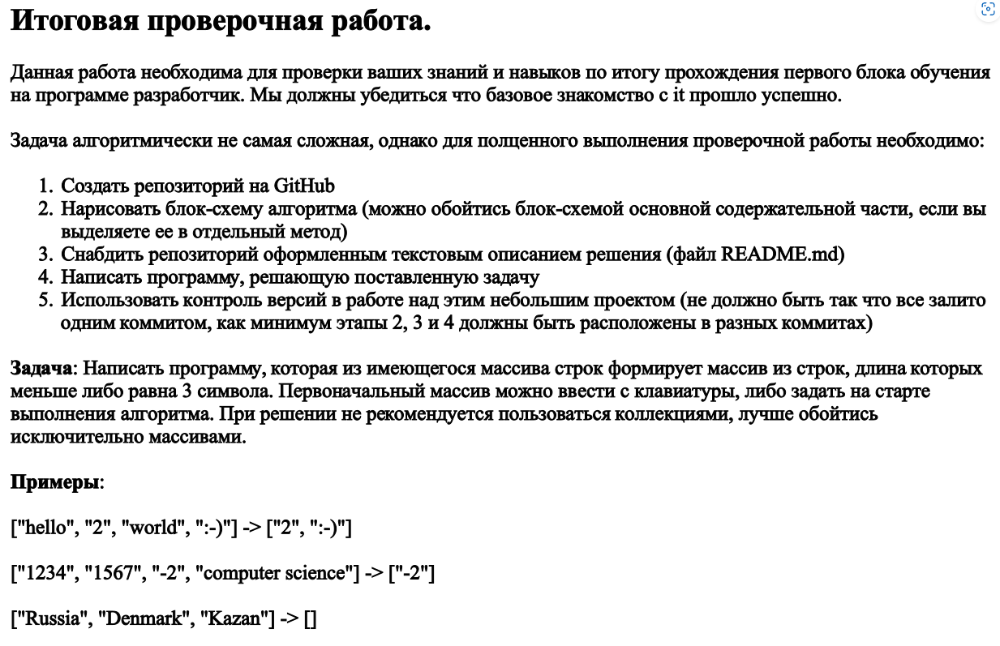

# Задача:

## 1. Программа пишет, что будет делать.
## 2. Задаем массив 
 *Наш массив:* ["123","c24","1c24","d3d5"]
## 2. Определение количества элементов нового массива.
Для того, чтобы создать новый массив,  нам надо определить сколько в нем будет элекменнов.
Пересчитываем кол-во элементов методом **HowManyElement**
## 3. Определение количества элементов нового массива.
Для того, чтобы создать новый массив,  нам надо определить сколько в нем будет элекменнов.
Пересчитываем кол-во элементов методом **HowManyElement**
## 4. Создаем новый массив 
Имя метода **FillNewArray**
1. Новый массив содержит необходимое количество символов
2. Все элементы нового массива строковые и именют не более 3 символов
## 5. Выводим массив в консоль

